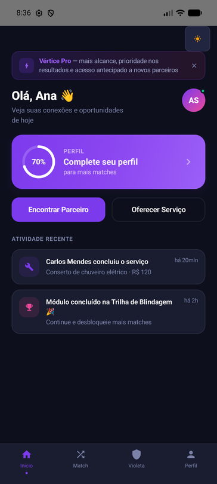
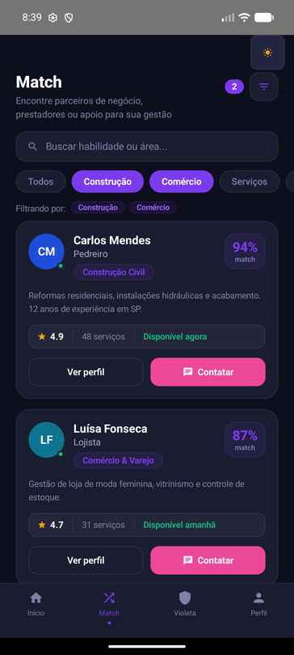
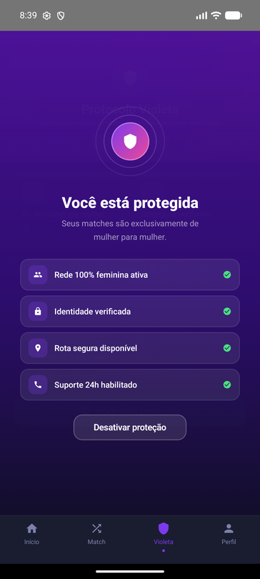
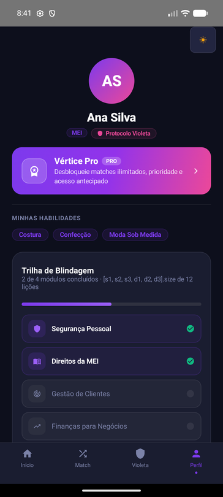
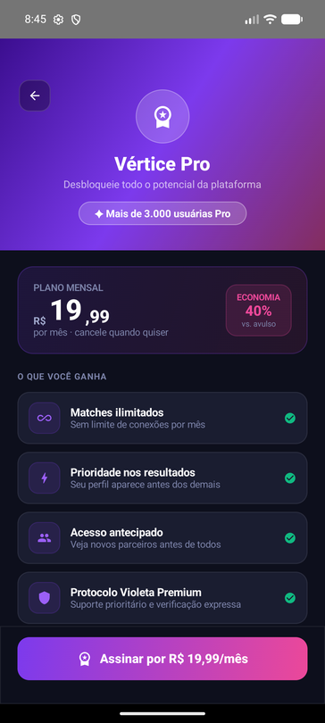

[Read in English](README-english.md)

# Vértice — App Android (Compose)

Aplicativo **Android (Kotlin + Jetpack Compose)** do **Vértice** — plataforma que conecta empreendedores informais brasileiros a parceiros estratégicos de gestão. Port 1:1 do protótipo Figma Make (`App.tsx`).

> **Empreenda Senac 2026 · 19ª Edição** — MVP funcional do conceito apresentado na maior competição de empreendedorismo e inovação do Brasil.

---

## ✨ O que o app faz

O Vértice ataca três barreiras reais de quem empreende na informalidade:

1. **Prestar & Requisitar serviço** — o prestador cadastra o que sabe fazer; o contratante busca e solicita. Avaliações mútuas constroem reputação verificável (substituto digital do boca a boca).
2. **Protocolo Violeta** — ambiente exclusivo para mulheres empreendedoras se conectarem com outras mulheres verificadas: identidade verificado, rota segura e suporte 24h. Segurança como alavanca econômica, não custo.
3. **Match de parceiros de gestão** — quem executa declara a lacuna; quem estrategiza declara a competência; a plataforma propõe o match e formaliza a parceria (interesse compartilhado, não empréstimo).

O modelo cobra **3–5%** apenas quando o negócio acontece, com **escrow** que libera o pagamento após o serviço entregue.

---

## Screen-Flows implementados (étapa atual)

- **Setup + Home** — saudação, card de progresso do perfil (anel 70%), botões "Encontrar Parceiro" / "Oferecer Serviço", atividade recente, banner **Vértice Pro** dispensável.
- **Match** — busca, filtros por área (Construção, Comércio, Serviços, Beleza, Alimentação), cards de profissionais com % de match, avaliação (⭐/5), nº de serviços e disponibilidade. **Integração com o Protocolo Violeta**: quando ative, exibe apenas prestadoras mulheres.
- **Protocolo Violeta** — toggle de proteção com overlay "Você está protegida": rede 100% feminina, identidade verificado, rota segura, suporte 24h.
- **Perfil + Trilha de Blindagem** — perfil "Ana Silva" (MIE), selo Protocolo Violeta, módulos de gestão/segurança com progresso persistente, upgrade Vértice Pro.
- **Modais**: Contatar / Solicitar Serviço (formulário completo com tipo, data, orçamento, local, urgência), Ver Perfil (avaliações recentes), Editar Perfil, Oferecer Serviço e Vértice Pro (plano mensal R$ 19,99).

## Stack

- **Kotlin** + **Jetpack Compose** (Material 3, Compose BOM 2024.06)
- **Navigation Compose** (aba guiada por estado `rememberSaveable`, rotação-safe)
- Tema **Dark/Light** com paleta roxos/rosa da marca, toggle no topo
- ícones Material extended

---

## Screenshots


*Home — saudação, progresso do perfil, ações rápidas e atividade recente*


*Match — busca, filtros por área e cards de prestadores com % de match*


*Protocolo Violeta ativo — rede 100% feminina, rota segura, suporte 24h*


*Perfil + Trilha de Blindagem — progresso dos módulos de gestão/segurança*


*Modal Vértice Pro — plano mensal, benefícios e CTA*

---

## Score do Projeto

```
app/src/main/java/com/vertice/app/
├── components/     # átomos reutilizáveis (StatusBar, ProgressRing, Avata, Pills...)
├── data/           # Freelancer + TrilhaData (seed)
├── nav/            # BottomNav + enum Screen
├── screens/        # Home, Match, Violeta, Perfil + 6 modais
└── ui/theme/       # Color, Theme (dark/light), Type
```
**~2.750 linhas de Kotlin** · `minSdk 26` · `targetSdk 34` · `applicationId com.vertice.app`

---

## Passo 1 — Abrir no Android Studio

1. Android Studio → **Open** → selecione a pasta `VerticeApp`.
2. Se pedir o Gradle Wrapper (`gradlew`), aceite — o Android Studio baixa e configura sozinho.
3. Aguarde a **Gradle Sync**. Se pedir SDK 34, instale via SDK Manager.

## Passo 2 — Rodar

- Crie um emulador (Pixel 6/8, API 34) ou conecte um celular com depuração USB.
- `Run` (Shift+F10).

> Build (no Windows): `gradle assembleDebug -Dorg.gradle.java.home="<Android Studio>\\jbr"` — o host usa Java 21 (JBR), não o Java 25 default. APK em `app/build/outputs/apk/debug/app-debug.apk`.

---

## Passo 3 — Fonte "Plus Jakarta Sans" (pendente)

O protótipo usa `Plus Jakarta Sans` (pesos 400–800). Passos:
1. Baixe em https://fonts.google.com/specimen/Plus+Jakarta+Sans ("Download family").
2. Coloque os arquivos estáticos em `app/src/main/res/font/` como `plus_jakarta_sans_regular.ttf`, `_medium.ttf`, `_semibold.ttf`, `_bold.ttf`, `_extrabold.ttf`.
3. Substitua o conteúdo de `ui/theme/Type.kt` pelo `FontFamily` correspondente (ver `README-english.md`).
4. **Sync** novamente.

---

## Roadmap / Próximos passos

- [x] Setup + Home
- [x] Match + modal Contatar
- [x] Protocolo Violeta + Ver Perfil
- [x] Perfil + Trilha de Blindagem + Editar Perfil
- [x] Modal Oferecer Serviço + Modal Vértice Pro
- [ ] Backend real (persistência + escrow) — hoje é protótipo local `rememberSaveable`
- [ ] Autenticação + verificação de identidade (Protocolo Violeta)
- [ ] Publicação em loja (Play Console)

---

## Como contribuir / testar

Sugira, abra issue ou manda um PR. O app é um protótipo de MVP — feedback de UX e arquitetura Compose é super bem-vindo.

**Vértice — Empreenda Senac 2026 · 19ª Edição**